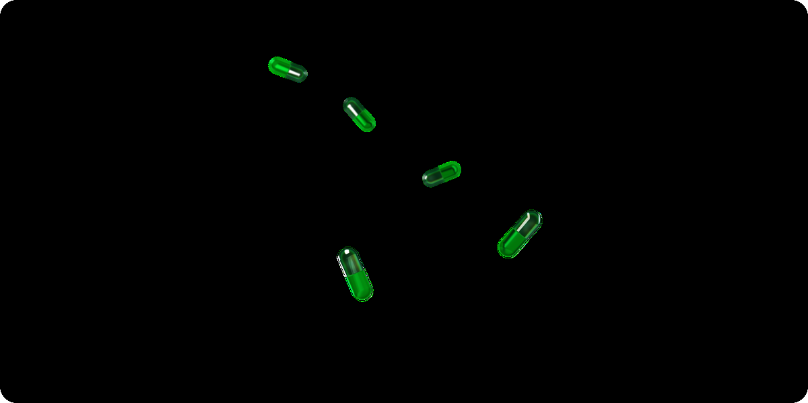

<div align="center">
  

  <h1>NOVA_WEB</h1>

  <p>
    Angular frontend of NOVA, an intelligent health platform that centralizes access to personalized medical information.
  </p>

<p>
  
  
  
</p>

</div>

<br />

## :notebook_with_decorative_cover: Table of Contents

- [About](#star2-about)
- [Screenshots](#camera-screenshots)
  * [Tech Stack](#space_invader-tech-stack)
  * [Features](#dart-features)
  * [Environment Variables](#key-environment-variables)
- [Getting Started](#toolbox-getting-started)
  * [Prerequisites](#bangbang-prerequisites)
  * [Installation](#gear-installation)
  * [Run Locally](#running-run-locally)
  * [With Docker](#whale-with-docker)
- [Related Repositories](#link-related-repositories)
- [Contact](#handshake-contact)

## :star2: About

NOVA_WEB is the user interface of NOVA, a platform that brings together several AI-powered health tools to help people better understand and track their physical and mental well-being, with analysis adapted to each user's profile and country.

The application covers three main use cases:

- validated psychological questionnaires (burnout, DASS-21, GAD-7, ISI, PHQ-9) with a prediction module (smartpred)
- a dermatological check-up module (scan-body) with image segmentation, a lesion heatmap, a risk score, history and triage advice
- a medication recognition module (scan-med)

It also includes account management, authentication, a paid subscription (success and cancellation pages), product documentation and a public roadmap.

## :camera: Screenshots

<p align="center">
  
  
</p>

### :space_invader: Tech Stack

<details>
  <summary>Frontend</summary>
  <ul>
    <li><a href="https://angular.dev/">Angular 19</a></li>
    <li><a href="https://www.typescriptlang.org/">TypeScript</a></li>
    <li><a href="https://tailwindcss.com/">Tailwind CSS 4</a> + <a href="https://daisyui.com/">DaisyUI</a> / <a href="https://flyonui.com/">FlyonUI</a></li>
    <li><a href="https://www.chartjs.org/">Chart.js</a> for tracking charts</li>
    <li><a href="https://spline.design/">Spline</a> for 3D visuals</li>
    <li><a href="https://github.com/matteobruni/tsparticles">tsParticles</a>, <a href="https://airbnb.io/lottie/">Lottie</a>, <a href="https://michalsnik.github.io/aos/">AOS</a> for animations</li>
    <li><a href="https://github.com/parallax/jsPDF">jsPDF</a> for exporting results to PDF</li>
  </ul>
</details>

<details>
  <summary>Deployment</summary>
  <ul>
    <li><a href="https://www.docker.com/">Docker</a></li>
  </ul>
</details>

### :dart: Features

- Psychological questionnaires (burnout, DASS-21, GAD-7, ISI, PHQ-9) with a prediction module
- AI-assisted dermatological check-up: lesion segmentation, heatmap, risk score, history, triage advice
- Medication recognition from a photo
- User account, authentication and site-wide password protected page
- Paid subscription with confirmation and cancellation pages
- Built-in documentation and product roadmap

### :key: Environment Variables

Configured in `src/environments/environment.ts` (dev) and `environment.prod.ts` (prod), including:

`apiUrl`: URL of the NOVA_API backend consumed by the frontend

`features.enableTTA`, `features.enableCamera`, `features.enableHistory`: feature flags

`features.maxImageSize`, `features.supportedFormats`: image upload constraints for the scan feature

## :toolbox: Getting Started

### :bangbang: Prerequisites

Node.js and Angular CLI.

```bash
npm install -g @angular/cli
```

### :gear: Installation

```bash
npm install
```

### :running: Run Locally

```bash
ng serve
```

Open `http://localhost:4200/`.

### :whale: With Docker

```bash
docker build -t nova-web .
docker run -p 4200:4200 nova-web
```

## :link: Related Repositories

NOVA_WEB is part of the NOVA suite of repositories:

- [NOVA_API](https://github.com/nova-health-platform/NOVA_API): backend API consumed by this frontend
- [NOVA_DB](https://github.com/nova-health-platform/NOVA_DB): reference data model and database access
- [NOVA_LOGS_DB](https://github.com/nova-health-platform/NOVA_LOGS_DB): application logging and monitoring
- [NOVA_ML_ANALYSIS](https://github.com/nova-health-platform/NOVA_ML_ANALYSIS): symptom analysis and machine learning models
- [NOVA_ML_PREPROD](https://github.com/nova-health-platform/NOVA_ML_PREPROD): model training and validation before production
- [NOVA_ML_MENTAL_HEALTH](https://github.com/nova-health-platform/NOVA_ML_MENTAL_HEALTH): models for psychological monitoring
- [NOVA_ML_SCAN_BODY](https://github.com/nova-health-platform/NOVA_ML_SCAN_BODY): vision models for the dermatological check-up
- [NOVA-CORE](https://github.com/nova-health-platform/NOVA-CORE): architecture overview and local orchestration for the whole platform

## :handshake: Contact

Brieuc Dumortier - [LinkedIn](https://www.linkedin.com/in/dumortier-brieuc/) - dumortier.contact@gmail.com

GitHub: [@BaditSad](https://github.com/BaditSad)
